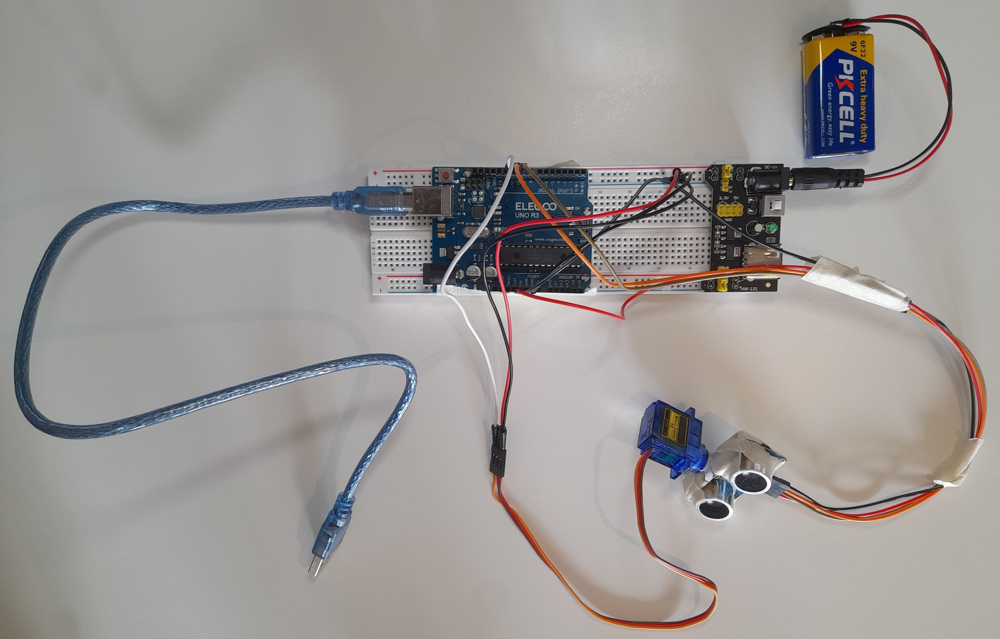
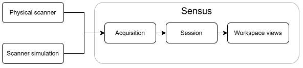
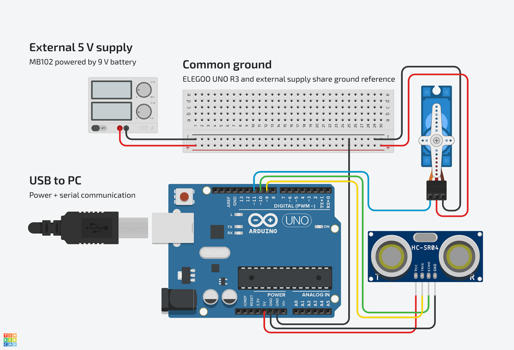

# Mark 1-A: Wired scanner

**Status:** Complete

Mark 1-A began with one physical range measurement made visible in Sensus. It
finished with a servo-driven scanner whose measurements Sensus can receive and
visualize. A simulation uses the same acquisition pipeline, and sessions keep
the measurements from each run.

**HC-SR04 → ELEGOO UNO R3 → USB serial → Sensus**

## Goal

The goal was to establish the first working scanner and understand its embedded
and software integration well enough to build on it. I chose to work through
Arduino IDE and library abstractions so I could complete a tangible system
before studying lower-level microcontroller behaviour in depth.

That meant learning to:

- use Arduino abstractions to control the SG90 and HC-SR04
- collect measurements while sweeping the sensor
- upload and run firmware on the ELEGOO UNO R3
- exchange commands and samples over USB serial
- design the first scanner protocol and read its data asynchronously in Sensus
- simulate scanner behaviour and visualize the results

Mark 1-A was not about perfecting the electronics, mounting, or sensor accuracy.
It was about getting the first system working and establishing a basis for later
stages.

## Result

The scanner is configured to sweep from -80° to +80° and sends its measurements
to Sensus over USB serial. For each measurement, the firmware moves toward a
target scanner bearing, triggers the HC-SR04, and reports the echo result and
target bearing as a range sample.

Sensus connects to the scanner, performs the handshake, and reads its description
and configuration before starting the run. It reads samples asynchronously,
turns them into range observations, and displays them in the scan, timeline, and
inspector views. When the run ends, Sensus tells the scanner to stop before
closing a normal connection. The scanner simulation uses the same acquisition
pipeline.

Each run creates an in-memory session. Stopping leaves its observations
available for inspection, starting another run creates a new session, and
clearing a session is an explicit action.

## Demonstration

<p align="center">
  <a href="https://youtu.be/p1uHBIeFYfA">
    
  </a>
</p>

<p align="center"><i>
<a href="https://youtu.be/p1uHBIeFYfA">▶ Watch the Mark 1-A demonstration: Sensus visualization and physical scanner operating together.</a>
</i></p>

After the bearing-to-servo correction, a physical test showed the scanner move
to its left starting bearing and then sweep toward the right. This checks the
sweep direction against the Sensus bearing convention. It does not measure
positioning or HC-SR04 accuracy.

<p align="center">
  
</p>

<p align="center"><i>
The Mark 1-A hardware setup.
</i></p>

## System overview

<p align="center">
  
</p>

<p align="center"><i>
Both scanner sources connect to Sensus through the same acquisition pipeline.
</i></p>

A scanner run creates a session containing its observations. The workspace uses
that session for visualization and inspection.

## Software and visualization

The **Scanner** view has connection and simulation controls. The **Scan** view
shows the scanner's coverage, collected observations, and latest measurement.
The **Timeline** shows distance, bearing, and sample status over the latest 15
seconds. The **Inspector** shows the latest sample and values Sensus calculates
from it.

A `RangeSample` is what the physical scanner or simulation reported. A
`RangeObservation` keeps that sample and adds values Sensus calculates from it,
such as distance and Cartesian position.

## Hardware

The scanner uses:

- [HC-SR04 ultrasonic ranging sensor](<../../../../Docs/Datasheets/HC-SR04 Ultrasonic Sensor Module.pdf>)
- [SG90 servo](<../../../../Docs/Datasheets/SG90 Servo Motor.pdf>)
- [ELEGOO UNO R3](<../../../../Docs/Datasheets/ELEGOO UNO R3 Board.pdf>)
- [MB102 breadboard power supply](<../../../../Docs/Datasheets/MB102 Breadboard 3.3V - 5V Power Supply.pdf>)
- 9 V battery
- breadboard and jumper wires
- USB connection to the development PC

The test setup is deliberately makeshift. The scanner assembly only needs to
stay stable enough for these experiments. Cleaner wiring, better mounting, or
upgraded components can come later when they solve a real problem.

### Circuit and wiring



<p align="center"><i>
Mark 1-A wiring illustration created with Autodesk Tinkercad.
Components are arranged to clarify their connections rather than
their physical placement.
</i></p>

The UNO is powered over USB and supplies the HC-SR04. The SG90 uses a separate
5 V supply from an MB102 breadboard power module fed by a 9 V battery. A servo
can draw substantially more current when starting, under load, or stalled, so
keeping that load off the UNO's 5 V rail is a precaution in this prototype.
The supplies share ground to give the servo control signal a common reference.

| Connection | Destination |
| --- | --- |
| UNO 5 V | HC-SR04 VCC |
| UNO GND | HC-SR04 GND |
| UNO D9 | HC-SR04 TRIG |
| UNO D10 | HC-SR04 ECHO |
| UNO D11 | SG90 signal |
| MB102 5 V rail | SG90 positive supply |
| MB102 ground rail | SG90 ground and UNO GND |

Keep the MB102 positive rail separate from the UNO 5 V pin. Sharing ground does
not require tying the two positive rails together.

### Scanner geometry

Sensus describes the scanner relative to its forward direction:

- negative bearing = left
- `0°` = forward
- positive bearing = right

Viewed from above, increasing bearing is clockwise. The configured range is
-80° to +80°. The firmware maps that scanner bearing to a pulse width for this
SG90: 2400 µs at -80°, 1500 µs at 0°, and 600 µs at +80°.

The 600–2400 µs operating range and approximate usable sweep were chosen after
simple physical testing of the assembled scanner. The firmware attaches the
servo with that pulse-width range and uses `writeMicroseconds`. Sensus does not
need the actuator pulse width. The SG90's nominal 180° rotation describes the
component rather than the configured scanner sweep.

The sample contains the target bearing used by the firmware. The SG90 does not
report its physical position to the UNO, so this is not an independently
measured bearing. The HC-SR04 documentation specifies a 15-degree measuring
angle, but the current scan does not visualize that angular spread. Each
measurement currently appears as a single bearing or ray.
This simplification can be revisited later.

## Firmware and acquisition

The [firmware](Mark-1-A.ino) performs four main jobs:

1. respond to the Sensus scanner protocol
2. translate the target bearing to a servo pulse width
3. trigger and measure the HC-SR04
4. serialize the resulting sample over the USB serial link

For each acquisition, the firmware:

1. sets the servo pulse width for the target scanner bearing
2. waits briefly for movement
3. emits the HC-SR04 trigger pulse
4. waits up to 30 ms for an echo
5. records the round-trip duration and whether an echo was received
6. writes a range sample
7. advances the bearing

The configured scan runs bidirectionally between -80° and +80° in 1° steps. Each
turnaround endpoint is sampled once. The return sweep starts one step inside
the endpoint with the next `SweepId`.

Each sample contains:

```text
RangeSample
├── Sequence
├── SweepId
├── ElapsedUs
├── BearingDegrees
├── RoundTripDurationUs
└── Status
```

`Status` is `Valid` when an echo is received and `NoEcho` when none arrives
within the timeout.

## Scanner protocol

The scanner uses **scanner protocol revision 1** over USB serial at 9600 baud.

Commands and samples are text lines ending with CRLF (`\r\n`).

A typical exchange looks like:

```text
Sensus  -> Scanner: SENSUS,1,PREPARE
Scanner -> Sensus:  SENSUS,1,DESCRIPTION
Scanner -> Sensus:  SCANNER,Sensus Rover,Mark 1-A
Scanner -> Sensus:  BOARD,ELEGOO UNO R3,ATmega328
Scanner -> Sensus:  RANGE_SENSOR,HC-SR04,2,400,15
Scanner -> Sensus:  SERVO,SG90,180
Scanner -> Sensus:  CONFIGURATION,-80,80,1,100,30000
Scanner -> Sensus:  SENSUS,1,READY

Sensus  -> Scanner: SENSUS,1,START
Scanner -> Sensus:  1,1,1250000,-80,5800,0

Sensus  -> Scanner: SENSUS,1,STOP
Scanner -> Sensus:  SENSUS,1,STOPPED
```

`Sensus Rover` in the `SCANNER` row names the project. This device is a scanner.
`PREPARE` resets the scanner's run state, returns the servo to its
starting bearing, and requests its description and configuration. `READY`
completes that response. Sensus validates it before sending `START`.

The scanner then writes range samples until Sensus sends `STOP`, which the
scanner acknowledges with `STOPPED`. Protocol revision 1 defines the message
format, while Mark 1-A identifies the Sensus Rover stage. Mark 1-B may keep
protocol revision 1 if wireless transport needs no change to the protocol. The
protocol revision should change when the protocol itself changes.

## Running the scanner

1. Build the circuit shown above with both power sources disconnected.
2. Set the MB102 output used by the servo to 5 V.
3. Connect the UNO and servo-supply grounds.
4. Leave clearance for servo movement.
5. Open [Mark-1-A.ino](Mark-1-A.ino) in the Arduino IDE.
6. Select the UNO board and its COM port.
7. Upload the firmware with the Arduino Servo library available.
8. Close the Arduino IDE Serial Monitor or other applications using the COM
   port. Serial Monitor and Sensus cannot use the same port at once.
9. Start Sensus from the repository root:

   ```powershell
   dotnet run --project Sensus/Sensus.csproj
   ```

10. Select the board's COM port and press **Connect**. If the board was connected
    after Sensus started, refresh the available ports first.
11. Inspect the scan, timeline, and latest observation.
12. Disconnect to stop acquisition.

The completed session remains available in Sensus until it is cleared or another
run begins.

The separate servo supply is a precaution because servo current can rise
substantially under load or stall. Keep the common ground and separate positive
rails shown above. This prototype circuit is not a validated general power
design.

## Verification and limitations

At Mark 1-A closeout, the automated software suite passed **71 of 71 tests**.

The physical scanner, protocol, and application have operated together as one
system. The bearing correction was then checked on the physical scanner. These
checks do not establish sensor or positioning accuracy.

Other current limitations include:

- Servo movement uses fixed, deliberately conservative delays. They have not
  been tuned to the shortest required settling time.
- The reported bearing is a target bearing, not measured servo position.
  Physical testing confirmed movement from the left start toward the right,
  but did not establish positioning accuracy across the full range.
- The HC-SR04's angular measuring width is not represented in the scan. Each
  measurement appears at a single bearing or ray.
- The scan view keeps all observations from the session, so older measurements
  remain visible even if the scene changes. It currently mixes live scanner
  visualization with accumulated, map-like behaviour. A future map view can
  handle world-relative aggregation when motion makes that necessary.
- Scan rendering uses straightforward WPF Canvas elements and layers. It has
  not been optimized for very large object counts, which the current system
  does not need.
- The mounting is makeshift, and the ranging behaviour has not been
  systematically measured or validated for accuracy.

## Retrospective

This retrospective is distilled from notes I kept while working on Mark 1-A.
It records where the project changed my understanding, including decisions that
only became clear after I had something working.

### From one measurement to a working system

The first goal was intentionally small: read one physical ultrasonic measurement
and draw it as a line in Sensus. I tend to understand unfamiliar concepts better
when I can approach them from more than one direction. Reading code and theory
gave me one model of the system. Visualizing its behaviour gave me another.

Seeing that measurement appear spatially in Sensus was the first moment I could
see where the project was going. Software was showing me something that had
happened in the physical world. That relationship became one of the things I
enjoyed most about Mark 1-A.

I began with very little intuition for serial communication in this kind of
system. I wanted one path that worked from end to end before designing the
larger architecture:

**sensor → firmware → serial connection → application → visualization**

The transport and protocol took more time to understand than I expected. Once
they became concrete, questions about connection ownership, interpreting
commands, and starting and stopping a run felt like familiar software problems
in a new setting. Getting that first path working gave me something real to
structure and improve.

### Simulation became infrastructure

I first wanted simulation so I could work on Sensus without connecting the
scanner every time. It became useful for more than convenience. The physical
scanner and simulation now use the same acquisition pipeline, so I can develop
visualization and application behaviour while the hardware is disconnected,
incomplete, or changing.

Building the simulation also made me look more carefully at the stream
abstraction. Producing a sample, serializing it, carrying bytes through a
stream, and processing the result in Sensus are separate responsibilities.
Understanding those separations made both the simulator and the application
architecture clearer. I expect this to remain useful as the scanner changes.

### Letting structure follow understanding

Early on, responsibilities lived close together while I was still discovering
how data moved through the application. Once I could see the boundaries between
communication, measurements, and presentation, I refactored the application
into views, viewmodels, services, and shared state. I am happier with that
structure because later work has clearer places to live.

I prefer that order. I would have been guessing at many of those boundaries if
I had designed a large architecture before making the scanner work.

### Learning hardware at the right depth

Hardware was the largest gap between my existing experience and this project.
Even the small SG90 servo raised questions about current, external power,
signal reference, and common ground. Making the electronics work was one thing.
Understanding why they worked was another. I can move much faster through
software and firmware than through hardware theory, so I am studying electronics
fundamentals separately and bringing that understanding back into Sensus.

For Mark 1-A, I chose Arduino abstractions rather than going deep into
microcontroller behaviour at once. The makeshift mounting, held together with
cardboard and painter's tape, follows the same approach. It needs to support
the experiments reliably enough for me to keep learning. Better construction
can come when it solves a real problem. For now, function matters more than
polish.

Physical testing exposed a wrong assumption in my first servo implementation.
I had decided how I wanted bearing to work in Sensus, then treated the Servo
library's angle values as if they matched that convention. When I tested the
scanner, it moved in the opposite direction.

I changed the firmware to map scanner bearing to servo pulse width directly. I
settled on a 600–2400 µs operating range, slightly inside the widest range I had
tested. It still gave me roughly the motion I wanted while leaving some margin
at the ends.

The useful lesson was not really about one particular servo. I had defined the
software view first and assumed the hardware would fit it. In future I want to
be more deliberate about how those two views connect, and check the physical
behaviour before treating them as equivalent.

### Scope became clearer

Recording and replay were originally much closer to Mark 1-A in my mental
roadmap. I had loosely thought of replay as reading samples back from a file.
Once streaming, source lifetime, and sessions became concrete, I realized it
deserved its own design rather than simply being added to the existing
acquisition pipeline. I left persistence and replay out of Mark 1-A, but now plan
to add them in Mark 1-B before motion becomes the main learning problem.

I also initially thought scanner visualization and future mapping might belong
in roughly the same view. I now see them as different questions. The scanner
view describes coverage and measurements relative to the scanner, while a map
will need to relate observations to the larger world as the rover moves. The
current scan view still keeps accumulated observations and mixes some map-like
behaviour into the scanner display. That separation is not implemented yet, but
recognizing it is enough for this stage.

The servo also made me think more about what the firmware should report to
Sensus. Right now the two sides share a fairly fixed idea of what a scanner
sample contains. The firmware hides details such as the servo pulse width and
reports the scanner bearing instead. For this scanner, I think that is a useful
abstraction.

As the physical system grows, though, I may want Sensus to have more visibility
into what the hardware is actually doing rather than receiving only the
already-interpreted scanner values. Some of that information could be reported
directly, while description and configuration from the handshake could give
Sensus the context needed to interpret it.

I do not know yet where that boundary should be. The current design is
sufficient for this stage, but the servo issue showed me that it is worth
revisiting when the hardware becomes more complex.

### What Mark 1-A changed

At the start I had little intuition for how a physical measurement would travel
all the way into Sensus. I can now follow that flow, see where the software
boundaries became useful, and name the hardware questions I still need to
study. Mark 1-A leaves me with a working scanner and a clearer starting point
for wireless communication, portable power, and replay in Mark 1-B.

## Next stage: Mark 1-B

Mark 1-B will keep the UNO R3 and replace the wired USB connection with an HC-06
Bluetooth serial link and portable power. The scanner will no longer need a USB
cable to the development PC. Session recording and replay are also planned
before the rover begins to move.

I expect Bluetooth serial communication to let Sensus reuse its existing serial
transport through a virtual COM port. Mark 1-B will test that assumption.
Establishing replay will also leave Mark 1-C more room to concentrate on motion,
drive control, and understanding and visualizing rover movement.
