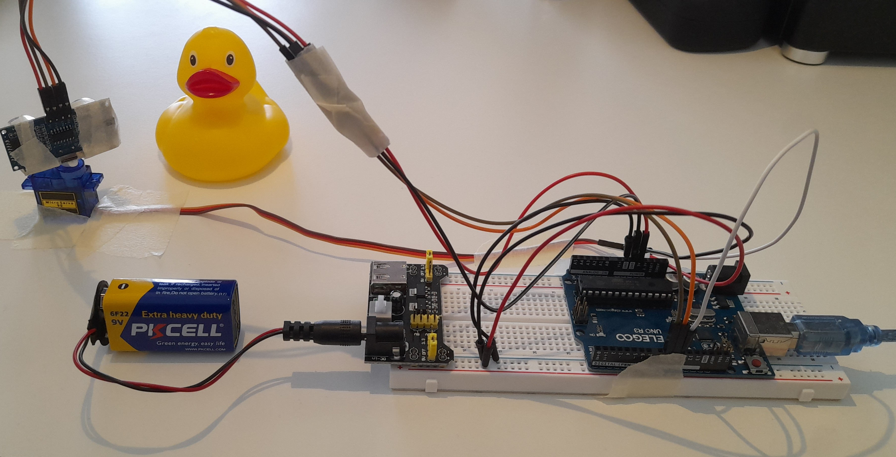

# Sensus Rover

**Sensus Rover** is a staged physical project built around Sensus. Mark 1 is its
first generation. Mark 1-A built a wired ultrasonic scanner, and Mark 1-B will
give it Bluetooth communication and portable power. Mark 1-C will integrate the
scanner with a mobile platform, becoming the first stage that is physically a
rover. Mark 2 will explore Wi-Fi. Later marks can take on more embedded control,
localization, and mapping.

## About

I started Sensus Rover because I wanted a project where software has to
interact with something physical. Before Sensus, I knew some basic circuit
theory and had worked with concepts such as breadboards, LEDs, and resistors,
partly through CircuitBench. I had barely built real circuits, though, and had
not meaningfully used a microcontroller board.

I can move much faster in application software than in electronics. Building
in stages lets me start each one with a working system and add a limited
amount of new learning friction. My goal is to understand each stage well
enough to build on it, not to reach a polished or sophisticated rover quickly.

I am also studying electronics fundamentals separately. Sensus gives me a
place to apply what I learn, but the project alone will not build that
foundation for me.

The hardware reflects that approach. Mark 1-A uses inexpensive kit components,
breadboards, cardboard, painter's tape, and a makeshift sensor and servo
mounting. It only needs to be stable enough for the experiments. Cleaner
circuits, better components, or purpose-built mounts can come when they solve
a problem I have actually encountered.

  

<i>
The Mark 1-A development setup, currently held together with cardboard and
painter's tape.
</i>

## Progression

Within Mark 1, stages A, B, and C lead toward the first complete rover. The
scanner remains a subsystem that could also serve another physical platform.
Later marks can change larger parts of the system when experience with earlier
stages gives me a reason to do so.

| Step | Status | New boundary | Direction |
| --- | --- | --- | --- |
| [**Mark 1-A: Wired scanner**](Marks/Mark-1-A/README.md) | **Complete** | Physical measurement + USB serial | Receive and visualize real range observations. |
| **Mark 1-B: Bluetooth scanner** | Next | Bluetooth communication + portable power | Record and replay sessions while retaining the scanner model. |
| **Mark 1-C: Rover** | Planned | Motion + drive control | Use the scanner and replay infrastructure while adding rover movement. |
| **Mark 2: Wi-Fi rover** | Planned | Wi-Fi network communication | Connect to the rover over a network. |
| **Mark 3: Integrated controller** | Planned | Embedded control | Move more control and coordination into the embedded system. |

Later directions include localization, cameras, and improved ranging sensors.
More advanced mapping can wait until I better understand how the rover moves
and how to track its position over time.

## Current state

Mark 1-A produced a servo-driven ultrasonic scanner that sends range samples
over USB serial. Sensus uses a scanner handshake to learn its configuration,
then receives measurements through the same acquisition pipeline used by the
simulation. Each run creates a session for the scan view, measurement timeline,
and latest-sample inspector.

The [**Mark 1-A README**](Marks/Mark-1-A/README.md) documents the circuit, scanner
protocol, setup, and detailed reflection.

## Why simulation is part of the project

My main motivation for adding simulation was to keep working on Sensus without
connecting the hardware every time. It has also become a way to design and
test scanner integration before the physical hardware needs to support it.
The scanner and simulation feed the same acquisition pipeline, so I can
experiment with the application while the hardware is unavailable or changing.

## Visualization direction

Building Mark 1-A made a distinction clearer to me: showing what the scanner
measures and building a map answer different questions. A scanner view describes
coverage and measurements relative to the scanner. A map will need to place
observations in the world as the rover moves.

The current scan view still mixes these responsibilities. It retains the
session's observations and combines scanner-oriented and map-like elements,
including a bearing grid, Cartesian grid, rulers, and accumulated
measurements. That is fine for Mark 1-A because recognizing the distinction is
the useful result for now. A future map view can separate world-relative
aggregation from the scanner-relative display when motion makes it necessary.

## Next stage: Mark 1-B

Mark 1-B will retain the UNO R3 and replace the physical USB connection with an
HC-06 Bluetooth serial link and portable power. The scanner will no longer need
a USB cable to the development PC. I also plan to add session recording and
replay. Replay will be especially useful once the rover moves, so I want that
infrastructure in place before Mark 1-C concentrates on understanding,
controlling, and visualizing motion.

Bluetooth may let Sensus reuse its existing serial transport through a virtual
COM port. I expect connection lifecycle and portable operation to be the main
new concerns in Mark 1-B, but that transport compatibility remains unverified.
