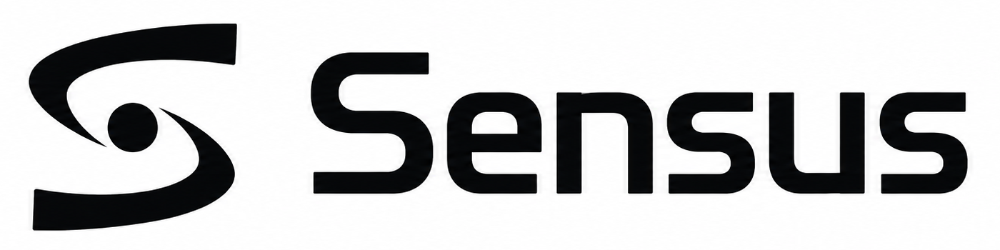
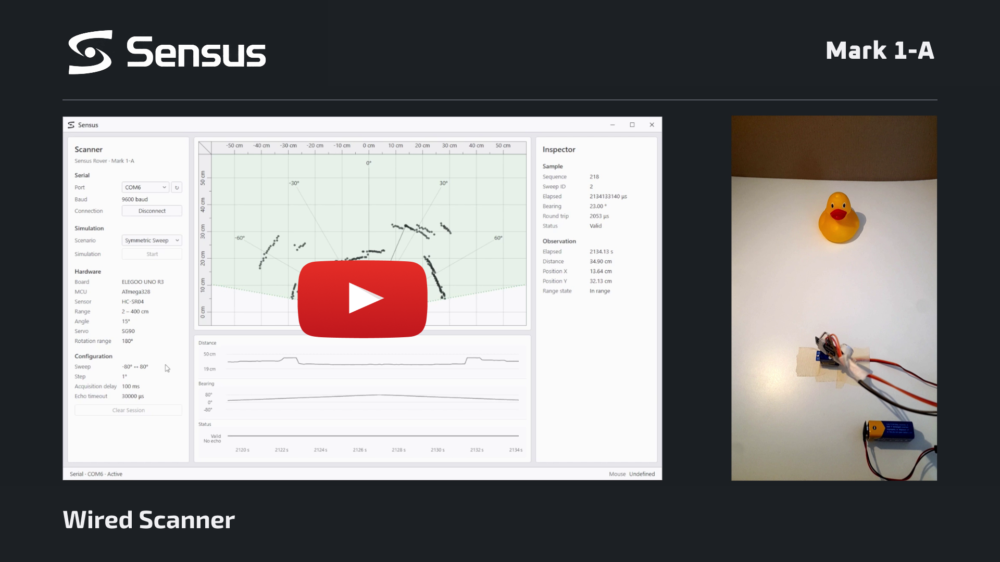
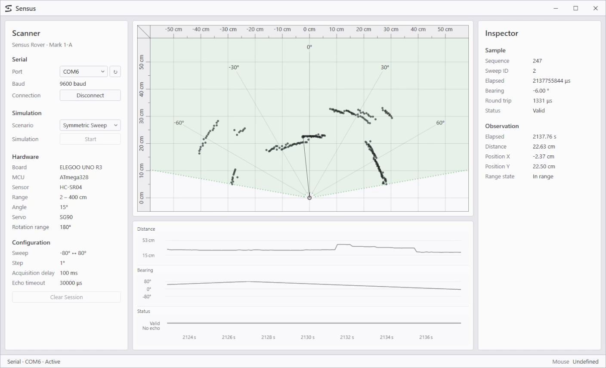

<h1 align="center">
  <br>
  
</h1>

<p align="center">
  
  
  
  
  
</p>

<p align="center"><i>
A C# WPF workbench for experimenting with physical sensors, embedded devices,
simulation, and visualization.
</i></p>

## Overview

**Sensus** explores how measurements from physical sensors make their way into
desktop software. I develop it through small, deliberately scoped hardware
experiments involving electronics and embedded firmware, using simulation and
visualization to observe and understand the system's behaviour.

The current hardware project is [**Sensus Rover**](Projects/SensusRover/README.md).
Its first generation progresses from the completed wired scanner (**Mark 1-A**)
to wireless communication over Bluetooth (**Mark 1-B**), before integrating the
scanner with a mobile platform (**Mark 1-C**).

## Mark 1-A: Wired scanner

Mark 1-A brings physical range measurements into Sensus for live visualization.

**HC-SR04 → ELEGOO UNO R3 → USB serial → Sensus**

A servo sweeps the ultrasonic sensor from -80° to +80° relative to its forward
direction.
Firmware on the UNO reports range samples over a USB serial link. After a
handshake, Sensus interprets incoming range samples as observations and displays
the scan, measurement timeline, and latest observation.

<p align="center">
  <a href="https://youtu.be/p1uHBIeFYfA">
    
  </a>
</p>

<p align="center"><i>
<a href="https://youtu.be/p1uHBIeFYfA">▶ Watch the Mark 1-A demonstration: Sensus visualization and physical scanner operating together.</a>
</i></p>

The [**Mark 1-A README**](Projects/SensusRover/Marks/Mark-1-A/README.md) records the
completed stage in detail and includes a retrospective distilled from notes
kept during development.

## Sensus workspace

Sensus can receive data from the physical scanner over USB serial or from a
desktop simulation. Both sources use the same acquisition pipeline.

<p align="center">
  
</p>

<p align="center"><i>
Live measurements from the physical scanner visualized in Sensus, with scan
coverage and a timeline of distance, bearing, and sample status.
</i></p>

Simulation lets the application and its visualizations be developed without
connecting the physical scanner.

## Current direction

The next stage, [**Mark 1-B: Bluetooth scanner**](Projects/SensusRover/README.md#progression),
will add Bluetooth communication and portable power, replacing the wired USB
connection. Session recording and replay are also planned before Mark 1-C
introduces motion and drive control.

## Run locally

Requires Windows and the .NET 10 SDK.

From the repository root:

```powershell
dotnet run --project Sensus/Sensus.csproj
```

To use Sensus without physical hardware, choose a simulation scenario in the
scanner panel and press **Start**.

To use the Mark 1-A scanner, upload its
[firmware](Projects/SensusRover/Marks/Mark-1-A/Mark-1-A.ino), select the board's
COM port, and press **Connect**. The scanner uses a USB serial link at 9600 baud.

## Documentation

- [**Sensus Rover**](Projects/SensusRover/README.md): the physical project's
  motivation, staged progression, and direction.
  - [**Mark 1-A: Wired scanner**](Projects/SensusRover/Marks/Mark-1-A/README.md):
    the completed stage's implementation and retrospective.
- [**Concepts**](Docs/concepts.md): terminology and data conventions.
- [**Datasheets**](Docs/Datasheets/): hardware references.

## Repository layout

```text
Sensus/          desktop application
Sensus.Tests/    automated tests
Projects/        hardware projects and firmware
Docs/            shared documentation and assets
```
